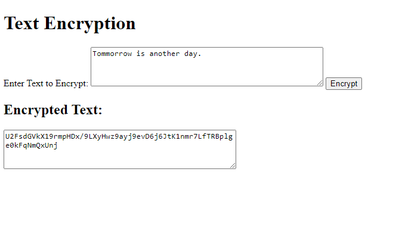
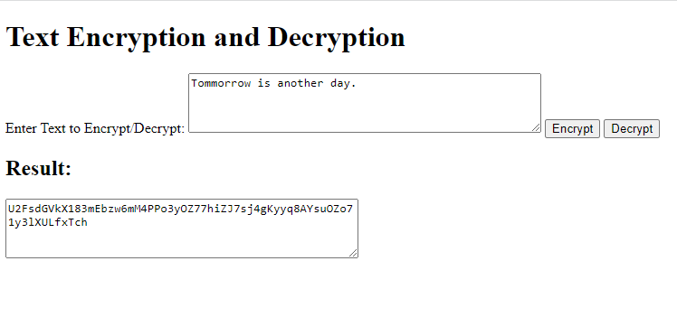
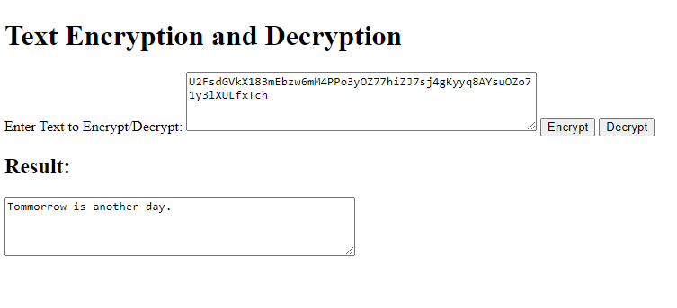
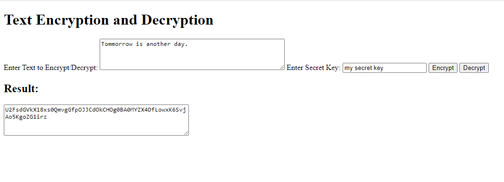
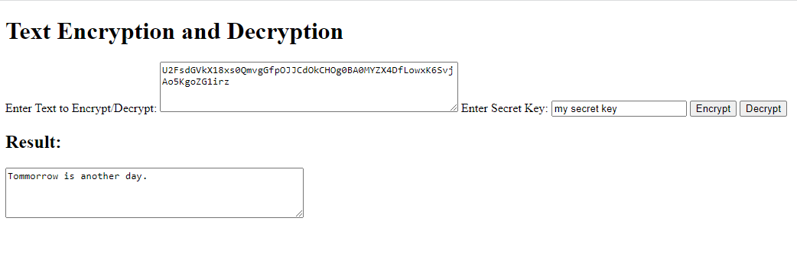
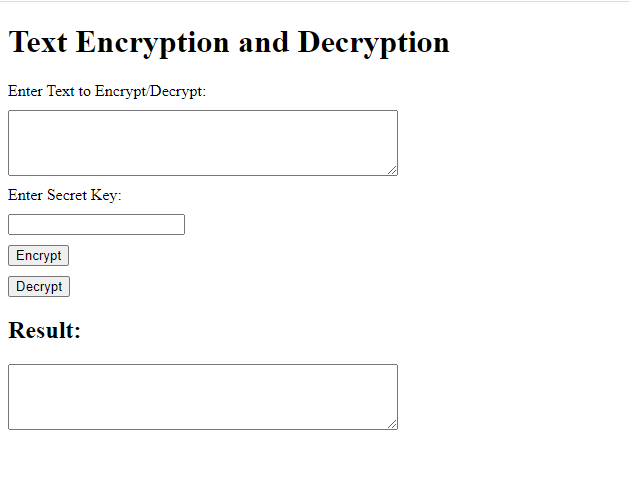
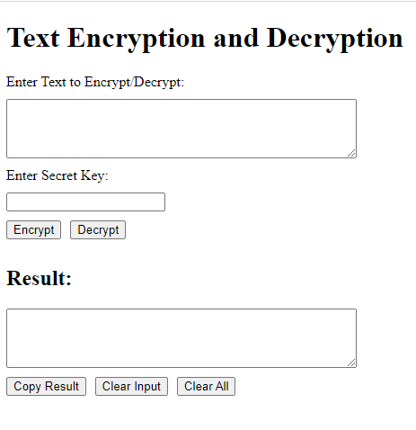
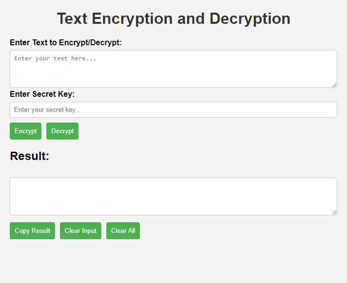

# Use ChatGPT to develop text encryption and decryption web page
With the help of ChatGPT, it's much easier to develop web pages. Here I'll show the flow to build [a web page to encrypt and decrypt text](./index.html) under the assistant of ChatGPT. And this is the [ChatGPT shared link of this conversation](https://chat.openai.com/share/ed2f3d2b-d33c-4976-be35-e69d1f537f8f).
## Implement functions
```
Me: Create a HTML page to encrpt text provided by the user.

ChatGPT: Creating a fully secure encryption system in a client-side HTML page isn't recommended, as it's generally not secure to handle encryption solely on the client side. Encryption and security are complex topics that often require server-side processing. However, I can provide you with a basic example of how you can use a simple JavaScript library to perform encryption on the client side. Please be aware that this is just a demonstration and should not be used for sensitive information in a real-world scenario.
...
```
Show results of [v1](./history/index_v1.html):



```
Me: Thanks for your suggestion about safety. This page is just to help user encrypt and decrypt text. Nothing will be saved. Could you add the function to decrpt text provided by the user?

ChatGPT: Certainly! Below is an updated version of the HTML page that includes both encryption and decryption functions:
...
```
Show results of [v2](./history/index_v2.html):

Encryption:



Decryption:



```
Me: Good job. Could you let user to provide the secret key?

ChatGPT: 
Certainly! We can modify the code to allow the user to input the secret key. Here's an updated version of the HTML page:
...
```
Show results of [v3](./history/index_v3.html):





## Adjust layouts
```
Me: Good job. I'd like to change the layout of this page. Could you move secrte key input box below text input box?
...
```
ChatGPT didn't do it correctly in the first time. But it corrected after one more promotion. Show results of [v5](./history/index_v5.html):



With more coversations about the layout and buttons, we get the result of [v7](./history/index_v7.html):



## Make the page visually more applealing
```
Me: Could you make the page more pretty?

ChatGPT: Certainly! Below is an updated version of the HTML page with some additional styling to make it more visually appealing. Feel free to further customize the styles according to your preferences.
...
``` 
Show results of improved styling [v8](./history/index_v8.html) which is also [the final version](index.html):



## Conclusion
I enjoyed this coding experience. ChatGPT is a powerful tool. Person can make their application much easier as they can focus more on ideas and less on coding part. 

For layout adjustments, sometimes human can be more efficient. Be flexible. Knowing about the coding languages is rather helpful for developers to work with ChatGPT. You can understand, verify the code and participte in the coding process when needed.
